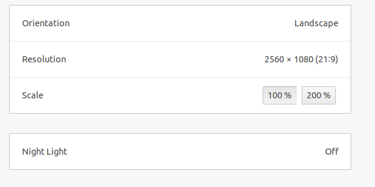

# Configure LG 29WK600 on Ubuntu
I bought a LG 29WK600 ultrawide monitor and the native resolution was not supported on Ubuntu. These are the steps I followed to get it working. Mostly thanks to the following video:

[](http://www.youtube.com/watch?v=LiP-YqtZoNQ "Ubuntu : Adding Screen Resolutions")

## Adding a screen resolution
Create a `Modeline` with `cvt`. Command should be in the format of `cvt <resolution width> <resoltuion height> <refresh rate>`
```
→ sudo cvt 2560 1080 60
# 2560x1080 59.98 Hz (CVT) hsync: 67.17 kHz; pclk: 230.00 MHz
Modeline "2560x1080_60.00"  230.00  2560 2720 2992 3424  1080 1083 1093 1120 -hsync +vsync
```

Add the `Modeline` generated above to `xrandr`
```
→ sudo xrandr --newmode "2560x1080_60.00"  230.00  2560 2720 2992 3424  1080 1083 1093 1120 -hsync +vsync
```

Get your monitor device name. In this example, mine is called `HDMI-1`.
```
→ sudo xrandr -q
Screen 0: minimum 320 x 200, current 1920 x 1080, maximum 8192 x 8192
DP-1 disconnected (normal left inverted right x axis y axis)
HDMI-1 connected primary 1920x1080+0+0 (normal left inverted right x axis y axis) 798mm x 334mm
   1920x1080     60.00*   50.00    59.94  
   1680x1050     59.88  
   1600x900      60.00  
   1280x1024     75.02    60.02  
   1280x800      59.91  
   1152x864      75.00    59.97  
   1280x720      60.00    50.00    59.94  
   1024x768      75.03    60.00  
   832x624       74.55  
   800x600       75.00    60.32  
   720x576       50.00  
   720x480       60.00    59.94  
   640x480       75.00    60.00    59.94  
HDMI-2 disconnected (normal left inverted right x axis y axis)
DP-2 disconnected (normal left inverted right x axis y axis)
HDMI-3 disconnected (normal left inverted right x axis y axis)
  2560x1080_60.00 (0x200) 230.000MHz -HSync +VSync
        h: width  2560 start 2720 end 2992 total 3424 skew    0 clock  67.17KHz
        v: height 1080 start 1083 end 1093 total 1120           clock  59.98Hz
```

Add your previously created mode to your device
```
→ sudo xrandr --addmode HDMI-1 2560x1080_60.00
```

You can now set your screen resolution in Ubuntu settings.



## Making it permanent
In order for your new screen resolution to be loaded every time you login, you will need to add it to your `.xprofile` file in your home directory.

I use the following script to configure mine. All you need to update are the first three variables.

```
→ cat .xprofile
#!/bin/sh -ex

## UPDATE HERE ##
MODE_NAME="2560x1080_60.00"
MODE="230.00  2560 2720 2992 3424  1080 1083 1093 1120 -hsync +vsync"
OUTPUT="HDMI-1"
## DO NOT CHANGE ANYTHING BELOW THIS LINE ##

CONNECTED_OUTPUT=$(xrandr --current | grep -i ${OUTPUT} | cut -f2 -d' ')

if [ "${CONNECTED_OUTPUT}" == "connected" ];
then
    xrandr --newmode "${MODE_NAME}" ${MODE}
    xrandr --addmode ${OUTPUT} "${MODE_NAME}"
    xrandr --output ${OUTPUT} --mode "${MODE_NAME}"
else
   echo "${MODE_NAME} IS NOT DETECTED !"
fi
```
